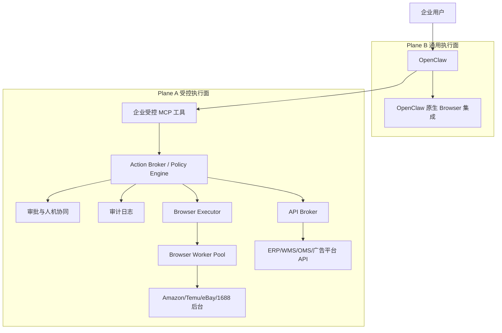
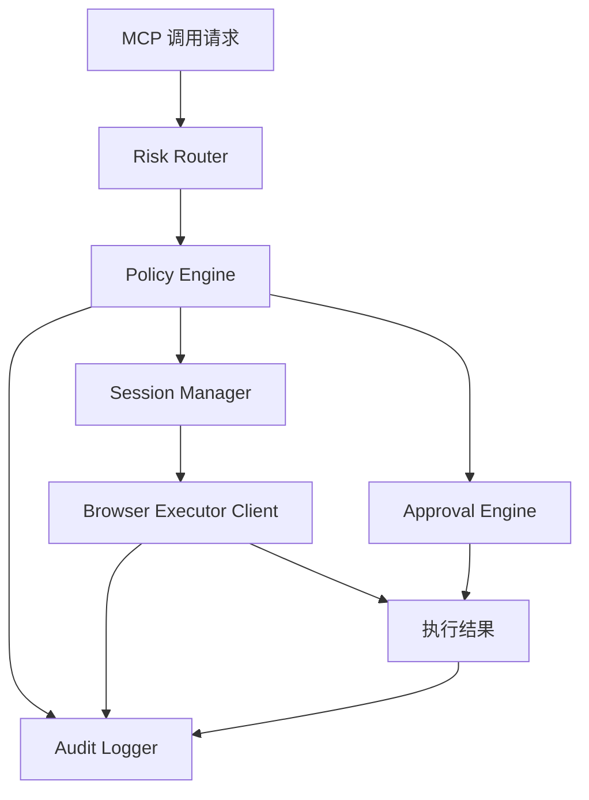
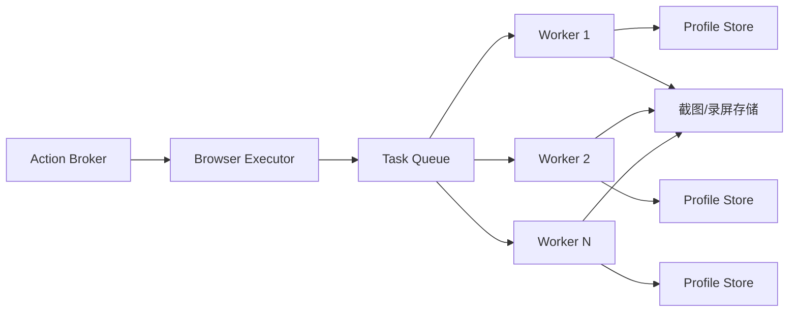
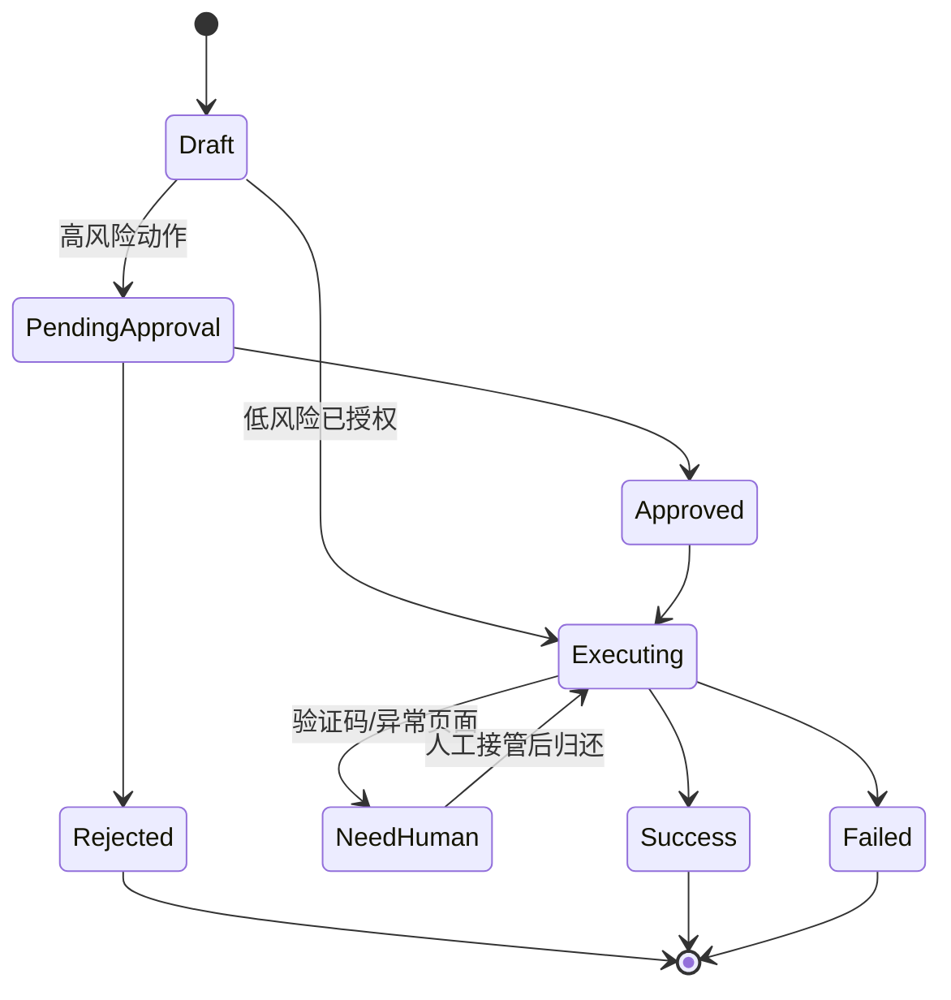
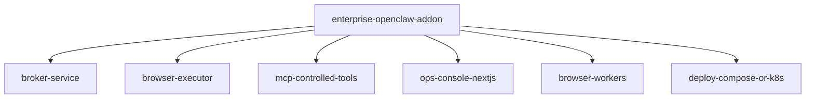

很好，你这个“双形态”思路是对的，而且是**真正企业可落地**的折中方案。

你本质上是在做一件很正确的事：

> **不阉割 OpenClaw 的通用能力；只把高风险执行面（登录态、敏感后台、可写操作）抽出来做企业级受控执行。**

这比“全都受控”更实用，也比“全都放开”安全得多。

------

# 一、先把整体设计原则定死（避免后面跑偏）

你的方案可以归纳为：

## 双浏览器执行面（Dual Browser Planes）

### Plane A：受控执行面（Sensitive / Controlled Plane）

用于：

- 跨境电商后台（Amazon / eBay / Temu / Walmart 等）
- 1688 / 供应商后台
- 任何需要登录且具备业务写权限的系统
- 涉及订单、价格、库存、消息发送、广告预算等动作

特点：

- 专用主机（或专用节点）
- 人机协同（HITL）
- 审批/审计/回放
- 受控 MCP（高层动作，不暴露原始 Playwright）

------

### Plane B：通用执行面（General / Native Plane）

用于：

- 无需登录或低风险登录场景
- 任意网页搜索、抓取、分析、公开信息读取
- 通用自动化辅助（非敏感）

特点：

- 保留 OpenClaw 默认浏览器集成方式
- 可本机，也可独立浏览器容器
- 不经过重型审批流程（但仍建议留日志）

------

## 这个设计的价值

1. **兼容 OpenClaw 原生体验**（不降级）
2. **企业敏感场景可控**（不会系统性炸）
3. **可渐进演化**（先通用，再逐步把高风险场景迁到受控面）
4. **技术实现可拆分**（不会一上来大改 OpenClaw 内核）

------

# 二、整体架构（兼容 OpenClaw 的实现方式）

核心思路：

> **OpenClaw 还是 OpenClaw。你新增的是一个“企业控制层 + 受控浏览器执行层”。**

也就是：**旁路增强，不侵入重写**。

------

## 架构总览图

------

# 三、关键设计：如何“完全兼容 OpenClaw”

你强调“完全兼容现有 OpenClaw”，这点我认同。做法应该是：

## 不改 OpenClaw 内核，采用“能力扩展”方式

### 兼容策略

1. **保留 OpenClaw 默认 browser 工具**（Plane B）
2. **新增企业 MCP 工具集**（Plane A）
3. **通过策略路由决定走哪条执行面**
4. **OpenClaw 看起来只是多了一组工具，不需要大改行为模型**

------

## 路由策略（核心）

给 Agent 一个“工具选择规则”，由系统和 Broker 双重约束：

### 规则（示例）

- 命中敏感域名/系统（amazon seller central、1688 后台、ERP）
  → **必须走 Plane A**
- 涉及写操作（发送、提交、改价、发布、保存）
  → **必须走 Plane A**
- 仅公开网页信息读取
  → 可走 Plane B
- 用户明确要求“仅分析，不登录”
  → Plane B 优先

> 注意：即使 Agent 误选 Plane B，Broker 层也要再次拦截（双保险）。

------

# 四、分层实现方案（一步一步）

你说“一步一步工作”，我按工程拆解给你。

------

## 第 1 步：定义“风险分流模型”（先做这个）

这是整个系统的路由中枢。

### 1.1 风险分类（建议）

把任务分成 4 类（你后面可映射到 UI）：

- **R0 公开只读**：公开网页读取、搜索、摘要
- **R1 低风险登录只读**：登录但仅看数据（如某些低敏内部系统）
- **R2 登录可写**：客服回复、listing 编辑、工单提交
- **R3 高价值可写**：改价、广告预算、库存、财务相关

### 1.2 分流策略

- R0 → Plane B（OpenClaw 原生）
- R1 → 视系统配置（默认 Plane A 更稳）
- R2/R3 → Plane A（强制）

### 1.3 实现形态

建议做成一个 `Risk Router` 模块（在 Broker 内）：

- 输入：任务意图、目标系统、动作类型
- 输出：`route = native | controlled`、`approval_required`、`audit_level`

------

## 第 2 步：实现 Plane A 的核心控制层（Broker）

这是企业能力的核心，不是浏览器本身。

## 2.1 Broker 职责（必须有）

### Action Broker / Policy Engine

负责：

- 任务路由（Plane A / B）
- 权限校验（人/角色/店铺/系统）
- 审批判断（是否 HITL）
- 调度 Browser Executor
- 写审计日志
- 返回结构化结果给 OpenClaw

------

## 2.2 Broker 内部模块建议

### 模块说明

- **Risk Router**：判断是否必须走受控面
- **Policy Engine**：权限、白名单、额度、时段策略
- **Approval Engine**：HITL 审批状态机
- **Session Manager**：浏览器 session 分配/绑定店铺
- **Executor Client**：调用远程浏览器执行层
- **Audit Logger**：全链路审计

------

## 第 3 步：实现 Plane A 的浏览器执行层（专用主机）

你问“单独主机还是其他形态”，这里给你标准答案：

## 推荐：专用主机（或专用节点）+ Browser Worker Pool

### 3.1 为什么专用主机更适合你

- 浏览器高风险（登录态、页面注入、下载文件）
- 浏览器吃资源（CPU/RAM）
- 跨境电商后台经常有复杂页面和验证码
- 你要做人机协同（远程观察/接管）

------

## 3.2 执行层组件

### Browser Executor（控制服务）

负责：

- 创建/回收浏览器 session
- 分配 worker
- 执行动作模板
- 截图/录屏/下载管理
- 返回结构化结果

### Browser Worker（多个）

每个 worker 是一个容器/进程：

- Playwright
- Chromium/Chrome
- 专用 profile 挂载
- 隔离下载目录

------

## 3.3 浏览器执行层部署图（Mermaid）

------

## 第 4 步：MCP 设计（重点：不要暴露原始 Playwright）

你问“是否要把 Playwright 封装为远程执行 MCP”，答案是：

## 要封成 MCP，但封的是“受控动作”，不是 Playwright 原语

------

## 4.1 MCP 分层（推荐）

### A. 业务型 MCP（最稳）

直接面向场景：

- `amazon_order_lookup`
- `amazon_message_prepare_reply`
- `temu_listing_open_editor`
- `1688_supplier_page_extract`

优点：

- 审计清晰
- 审批容易
- 权限边界明确

------

### B. 页面模板型 MCP（兼顾灵活）

- `browser_open_page(template="amazon_orders")`
- `browser_action(template="amazon_orders", action="search_order", params={...})`
- `browser_extract(template="amazon_order_detail", schema="logistics")`

优点：

- 通用性更好
- 不暴露裸 Playwright

------

### C. 禁止直接给 Agent 的能力

- `goto(url)`
- `click(selector)`
- `evaluate(js)`
- `type(selector, text)`

这些只能在 Browser Executor 内部使用，不能给 Agent 直接调用。

------

## 4.2 MCP 接口返回结果建议（统一结构）

每个 MCP 返回：

- `status`（success / need_human / need_approval / failed）
- `summary`（给 Agent 的文字摘要）
- `data`（结构化字段）
- `evidence`（截图、页面摘要）
- `session_ref`（如需人工接管）
- `audit_ref`（审计追踪 ID）

这样 OpenClaw 可以继续“思考”，同时你能做企业治理。

------

## 第 5 步：人机协同（HITL）设计（你的方案关键亮点）

你方案里的核心卖点不是“自动化”，而是“专业操作可控”。

## 5.1 什么时候触发 HITL

建议以下情况必须人工介入：

- 首次登录 / 验证码 / 二次验证
- 点击“提交/发送/保存/发布”
- 改价 / 库存 / 广告预算
- 检测到异常页面（DOM 不匹配、疑似风控页）
- 任务超时重试后仍失败

------

## 5.2 HITL 状态机（Mermaid）

------

## 5.3 人工接管建议

做一个简单前端（你用 Next.js 很适合）：

- 显示当前页面截图流
- 显示 Agent 计划动作
- “批准并执行”
- “人工接管”
- “拒绝并备注”
- “执行回放/证据查看”

这会非常像企业版“AI 操作台”。

------

## 第 6 步：Plane B（OpenClaw 原生浏览器）怎么纳管但不拖慢

你不想把 OpenClaw 降级，这是对的。Plane B 就保持轻量。

## 6.1 Plane B 允许场景

- 公开网页搜索、阅读、提取
- 非敏感网站自动化
- 通用内容整理

## 6.2 但仍建议加最小治理（不要裸奔）

即使是 Plane B，也建议：

- 记录基本审计（谁、何时、访问了哪个域名）
- 域名黑名单（禁止访问企业敏感域名）
- 结果日志抽样留存
- 可配置“强制升级到 Plane A”的域名规则

> 这样你保留了 OpenClaw 的灵活性，同时防止误入敏感站点。

------

# 五、会话与身份模型（跨境电商场景必须做）

这是你企业场景的关键，不然会串店铺、串权限。

## 5.1 会话绑定维度（Plane A）

每个受控浏览器 session 必须绑定：

- `tenant_id`（企业）
- `store_id`（店铺）
- `platform`（amazon/temu/ebay/1688）
- `role_scope`（客服/运营/采购）
- `risk_scope`（只读/可写）
- `profile_id`（浏览器 profile）
- `ttl`（有效期）

------

## 5.2 Profile 策略

- 每店铺一个专用 profile（至少）
- 不允许复用员工个人浏览器 profile
- profile 存储加密（至少磁盘加密）
- profile 目录只挂给对应 worker

------

## 5.3 Session 生命周期

- 创建（按任务申请）
- 复用（短时间内同店铺同角色可复用）
- 续租（心跳）
- 回收（超时自动销毁）
- 强制失效（检测异常/风控）

------

# 六、与 ERP / 平台 API 的统一策略（浏览器 + API 双栈）

你场景里不是只有浏览器，还有 ERP/API。

最好的做法不是分开治理，而是：

> **统一走 Broker，同一个权限/审批/审计模型。**

------

## 6.1 统一执行抽象（建议）

无论是浏览器动作还是 API 动作，Broker 都抽象成 `Action`：

- `action_type`: `browser` / `api`
- `target_system`: `amazon` / `erp` / `1688`
- `operation`: `read_order` / `prepare_reply` / `update_price`
- `risk_level`: `R0..R3`
- `approval_required`: `bool`

这样你的审批流、审计流可以复用一套。

------

## 6.2 最佳实践（很重要）

- 能走 API 的优先走 API（稳定、可审计）
- 浏览器只补 API 不足部分（页面流程、后台无 API 的动作）
- 同一任务可混合：
  - 浏览器读页面
  - API 查 ERP
  - Agent 生成方案
  - 人工审批
  - API 或浏览器执行

这才是企业真实可用的方案。

------

# 七、安全与能力的平衡（你最关心的点）

你说“不能为了安全把 OpenClaw 变废”，这里给你一个可执行的平衡框架。

## 7.1 双模自治（建议你做成产品能力）

### 模式 1：自由模式（Plane B）

- 保留 OpenClaw 原生能力
- 适用于通用探索和低风险任务
- 限定域名/最小日志即可

### 模式 2：企业受控模式（Plane A）

- 用于敏感系统
- 有审批、有审计、有会话绑定
- 支持 HITL 接管

用户体验上不是“禁用”，而是“系统自动切换到专业模式”。

------

## 7.2 不要追求“绝对禁止”

你要避免两个极端：

- 极端1：全禁（失去生产力）
- 极端2：全放（系统性风险）

你这个双形态设计本身就是正确答案。

------

# 八、建议的技术栈与实现（贴近你现有习惯）

你常用 Go/FastAPI/Next.js，我给你一个兼容组合：

## 8.1 推荐职责分工

### OpenClaw

- 原样使用（Agent Runtime + 原生 Browser 仍在）

### Broker（建议 Go 或 FastAPI）

- 如果你偏稳定和性能：**Go**
- 如果你想快速迭代：**FastAPI**
- 负责策略、审批、审计、调度

### Browser Executor（建议 Python）

- Playwright Python 生态成熟
- 实现快
- 适合做 Worker 执行层

### 前端控制台（Next.js）

- 审批台
- 人工接管台
- 执行回放与证据

### 存储

- PostgreSQL（任务、审批、审计元数据）
- 对象存储（截图、录屏）
- Redis（队列、会话租约、短期状态）

------

## 8.2 组件目录建议（示例）

------

# 九、上线路线图（一步一步，避免大爆炸）

## Phase 1：先打通 Plane A 最小闭环

目标：有受控能力可跑，不追求全功能

先做：

1. Broker（基础权限 + 审计）
2. Browser Executor（单 worker）
3. 3 个 MCP（受控场景）
4. 审批页（最简版）
5. 人工接管（截图+手动继续）

### 推荐首批 MCP（跨境电商）

- 订单查询（只读）
- 打开客服消息页并提取内容（只读）
- 生成回复草稿（不发送）

------

## Phase 2：加入真正的写操作（HITL）

增加：

- “发送消息”类动作（审批后执行）
- “编辑 listing 草稿”类动作（审批后保存）
- 验证码/风控页人工接管

------

## Phase 3：Plane B 纳管（轻治理）

- 给 OpenClaw 原生 browser 增加域名规则
- 增加基础访问审计
- 敏感域名自动升级到 Plane A

------

## Phase 4：规模化（多 worker / 多店铺）

- 浏览器池
- 会话池
- 配额/限流
- 多租户隔离

------

# 十、你这个设计的最终形态（产品层表达）

如果你后面要对外卖（企业版），你可以这样定义能力：

## 企业浏览器自动化双引擎

### 通用引擎（General Browser）

- 保留 OpenClaw 原生灵活能力
- 适合通用网页任务

### 受控引擎（Controlled Browser）

- 专用于企业敏感系统
- 审批、审计、回放、人机协同
- 会话隔离与权限治理

这个表达非常容易让老板和安全负责人都听懂。

------

# 十一、最后给你一个“决策建议”（拍板）

你的方向完全正确，我建议你就按这个架构推进，关键是：

## 必须优先做的 4 个点（顺序别乱）

1. **Broker（策略+审批+审计）**
2. **受控 Browser Executor（专用主机）**
3. **受控 MCP（高层动作封装）**
4. **会话/店铺/Profile 绑定模型**

不是先做一堆 Playwright 脚本。

------

如果你要，我下一步可以直接给你输出一版 **详细技术蓝图 v1**（可以给研发开工）：

- Broker API 设计（接口字段）
- MCP Tool 定义（请求/响应 schema）
- Browser Executor 任务模型与状态机
- Session/Profile 数据表设计（PostgreSQL）
- 审批与人工接管前端页面结构（Next.js）
- Docker Compose 部署清单（单机版 / 双机版）

这版我可以按你偏好的技术栈（Go 或 FastAPI）分别给。